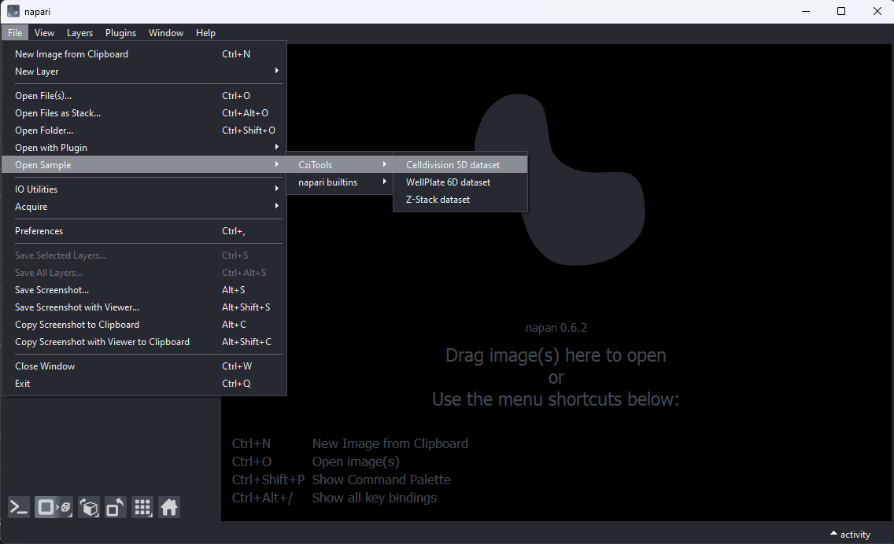
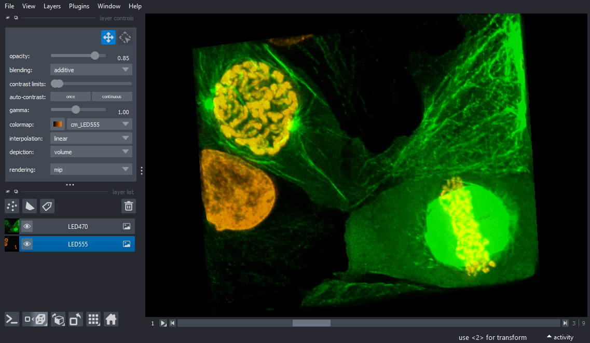
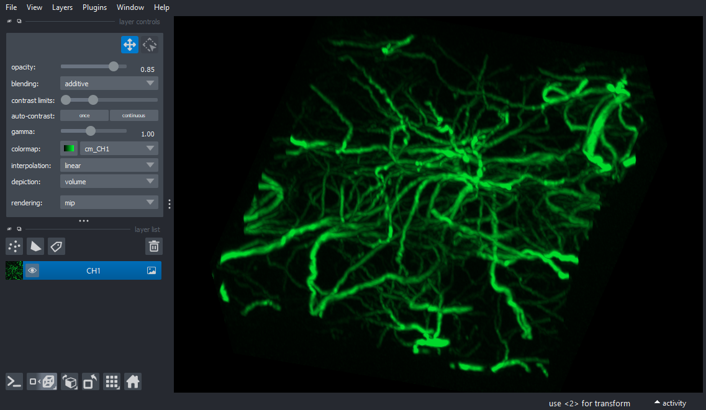
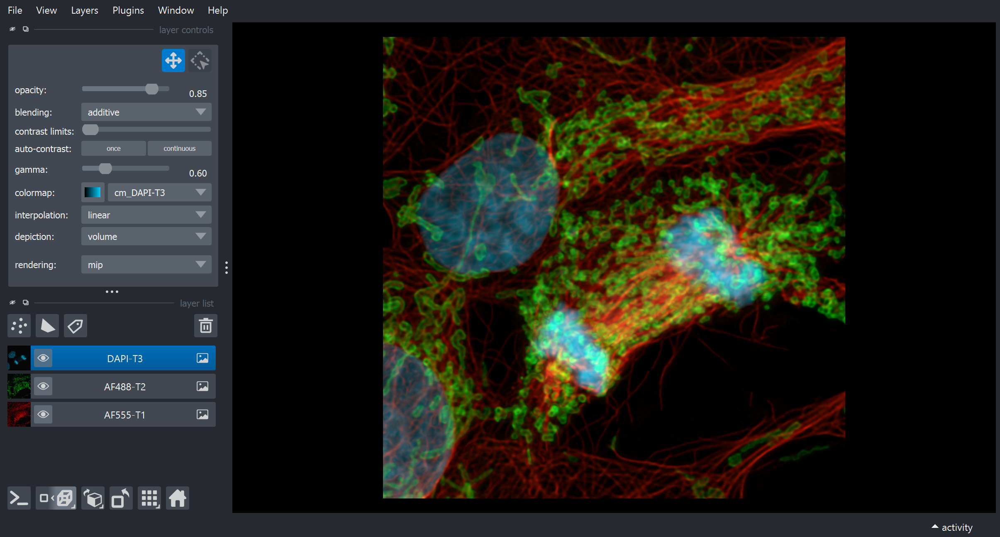
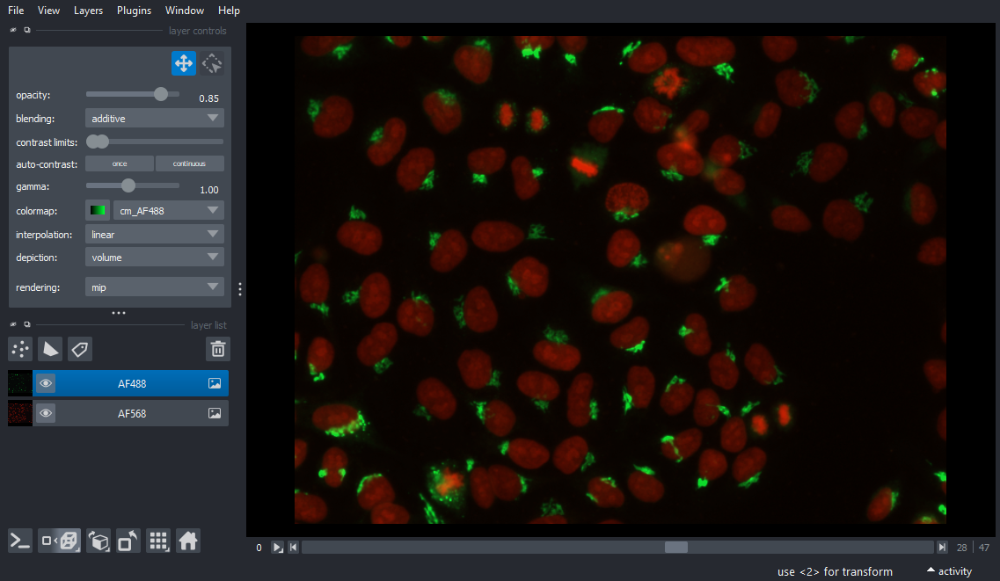

# napari-czitools

Plugin to read CZI image file and metadata

----------------------------------

This [napari] plugin was generated with [copier] using the [napari-plugin-template].

<!--
Don't miss the full getting started guide to set up your new package:
https://github.com/napari/napari-plugin-template#getting-started

and review the napari docs for plugin developers:
https://napari.org/stable/plugins/index.html
-->

## Installation

You can install `napari-czitools` via [pip]:

    pip install napari-czitools

To install latest development version :

    pip install git+https://github.com/sebi06/napari-czitools.git

## Supported OS

Right now the plugin is tested on Linux and Windows since there are no official wheels. It should work on MacOS as well, but this has not been tested yet.

## What does the plugin do

The plugin provides a reader for CZI files and allows to load the image data into [napari]. It also reads the metadata from the CZI file and displays it in the metadata panel of [napari].

### Core Functionalities

* Open complete CZI Files and display the metadata in Napari using the [czitools] package

* Open different CZI Image sample data (not display of metadata yet)
  * will be opened using via an internet connection if not found locally in current directory `../src/napari_czitools/sample_data

### Sample Data - CellDivision 5D Stack

### Sample Data - 3D Stack

### Sample Data - AiryScan 3D Stack

### Sample Data - Wellplate Data

   `
* Open CZI Metadata only via "Plugins > Advanced CZI Reader (CziReadTools)"

## What does the plugin NOT do

### Remarks

## Contributing

Contributions are very welcome. Tests can be run with [tox], please ensure
the coverage at least stays the same before you submit a pull request.

## License

Distributed under the terms of the [MIT] license,
"napari-czitools" is free and open source software

## Issues

If you encounter any problems, please [file an issue] along with a detailed description.

[napari]: https://github.com/napari/napari
[copier]: https://copier.readthedocs.io/en/stable/
[@napari]: https://github.com/napari
[MIT]: http://opensource.org/licenses/MIT
[BSD-3]: http://opensource.org/licenses/BSD-3-Clause
[GNU GPL v3.0]: http://www.gnu.org/licenses/gpl-3.0.txt
[GNU LGPL v3.0]: http://www.gnu.org/licenses/lgpl-3.0.txt
[Apache Software License 2.0]: http://www.apache.org/licenses/LICENSE-2.0
[Mozilla Public License 2.0]: https://www.mozilla.org/media/MPL/2.0/index.txt
[napari-plugin-template]: https://github.com/napari/napari-plugin-template
[file an issue]: https://github.com/sebi06/napari-czitools/issues
[tox]: https://tox.readthedocs.io/en/latest/
[pip]: https://pypi.org/project/pip/
[PyPI]: https://pypi.org/
[czitools]: https://pypi.org/project/czitools/
