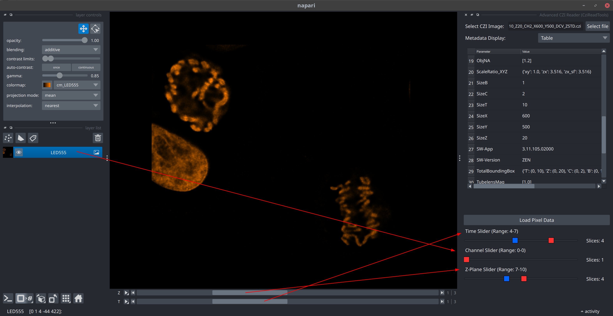

- [napari-czitools](#napari-czitools)
  - [Installation](#installation)
  - [Supported Operating Systems](#supported-operating-systems)
  - [Usage - Core Functionalities](#usage---core-functionalities)
    - [Open Complete CZI Files](#open-complete-czi-files)
    - [Open CZI Sample Data](#open-czi-sample-data)
      - [CellDivision 5D Stack](#celldivision-5d-stack)
      - [Neurons 3D Stack](#neurons-3d-stack)
      - [AiryScan 3D Stack](#airyscan-3d-stack)
      - [Wellplate Data](#wellplate-data)
    - [Advanced CZI Reader (CziReadTools) plugin](#advanced-czi-reader-czireadtools-plugin)
  - [Current Limitations](#current-limitations)
    - [Future plans](#future-plans)
  - [Contributing](#contributing)
  - [License](#license)
  - [Issues](#issues)
- [Disclaimer](#disclaimer)

# napari-czitools

Plugin to read CZI image file and metadata

----------------------------------

This [napari] plugin was generated with [copier] using the [napari-plugin-template].

<!--
Don't miss the full getting started guide to set up your new package:
https://github.com/napari/napari-plugin-template#getting-started

and review the napari docs for plugin developers:
https://napari.org/stable/plugins/index.html
-->

## Installation

You can install `napari-czitools` via [pip]:

    pip install napari-czitools

To install latest development version :

    pip install git+https://github.com/sebi06/napari-czitools.git

## Supported Operating Systems

Currently this only tested on:

- Linux
- Windows

MacOS is not supported yet out of the box yet, but [czitools] uses [pylibCZIrw]. But it should be possible to install it manually: [MaxOS wheels for pylibCZIrw] (read and write CZI files on MacOS).

## Usage - Core Functionalities

The plugin provides a reader for CZI files and allows to load the image data into [napari]. It also reads the metadata from the CZI file and displays it in the metadata panel of [napari].

### Open Complete CZI Files

- Open complete CZI Files and display the metadata in Napari using the [czitools] package

- Open different CZI Image sample data
- if not found locally in current directory `../src/napari_czitools/sample_data` it will be opened from remote repository (might be slow)

### Open CZI Sample Data

#### CellDivision 5D Stack

#### Neurons 3D Stack

#### AiryScan 3D Stack

#### Wellplate Data

### Advanced CZI Reader (CziReadTools) plugin

Select the plugin to show the UI in the right panel of the Napari UI via "Plugins > Advanced CZI Reader (CziReadTools)"

1) Select the CZI file to read its metadata
2) Once the metadata are read the display can be toggled between a **table** and a **tree view**
3) The metadata will update the dimension double-range sliders and enable reading the pixel data

1) Metadata will be shown as a **table** or as a **tree view**
2) The **Load Pixel Data** button will be enabled once the metadata is read
3) The **Dimension Sliders** will be enabled and allow to select an range to be read for all available dimensions

- The dimensions slider allow to define size of CZI subset to be read
- This allows to read parts of a CZI image dataset
- Important - when reading a subset the metadata will still reflects the size of the complete CZI

- Example for reading a subset
  - Timepoints (4-7): 4 slices or T=4
  - Channels (0-0): 1 slice or CH=1
  - Z-Plane (7-10): 4 slices or Z=4

## Current Limitations

The plugin is still in its very early stage, therefor expect bugs and breaking changes

- reading CZI with multiple scenes only works when the scenes have equal size
- opening the sample CZI files will not display the CZI metadata right now

### Future plans

- allow reading individual scenes when scenes have different sizes
- upgrade [pylibCZIrw] to allow use [bioio-czi] for even better reading
- export of metadata table

Feedback is always welcome!

## Contributing

Contributions are very welcome. Tests can be run with [tox], please ensure
the coverage at least stays the same before you submit a pull request.

## License

Distributed under the terms of the [MIT] license,
"napari-czitools" is free and open source software

## Issues

If you encounter any problems, please [file an issue] along with a detailed description.

# Disclaimer

The software & scripts are free to use for everybody. The author undertakes no warranty concerning the use of this plugins and scripts. Use them on your own risk.

By using this plugin you agree to this disclaimer.

Version: 2025.08.20

[napari]: https://github.com/napari/napari
[copier]: https://copier.readthedocs.io/en/stable/
[@napari]: https://github.com/napari
[MIT]: http://opensource.org/licenses/MIT
[napari-plugin-template]: https://github.com/napari/napari-plugin-template
[file an issue]: https://github.com/sebi06/napari-czitools/issues
[tox]: https://tox.readthedocs.io/en/latest/
[pip]: https://pypi.org/project/pip/
[czitools]: https://pypi.org/project/czitools/
[pylibCZIrw]: https://pypi.org/project/pylibCZIrw/
[MaxOS wheels for pylibCZIrw]: https://pypi.scm.io/#/package/pylibczirw
[bioio-czi]: https://pypi.org/project/bioio-czi/
